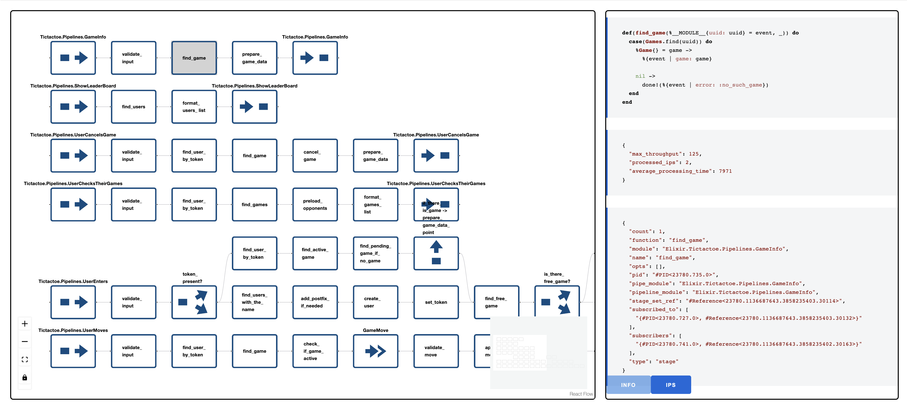

# ALFMonitor

### Monitor your ALF application!

See:
- [ALF — Flow-based Application Layer Framework](https://github.com/antonmi/alf)
- [TicTacToe example](https://github.com/antonmi/tictactoe)


```sh
NODE=node1@localhost iex --sname node2@localhost -S mix phx.server
```


