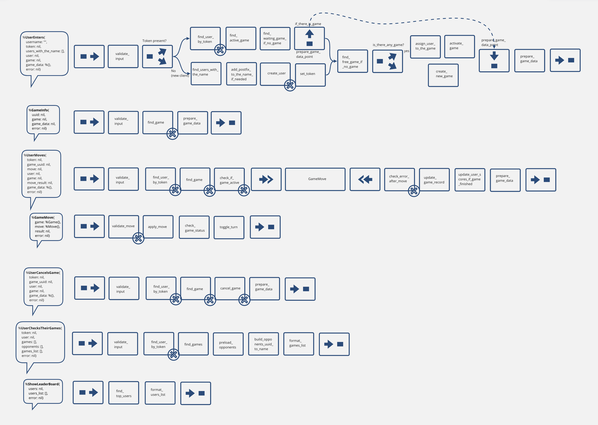

# Tictactoe

**Multiplayer tic-tac-toe game implemented using the ALF framework**

### Dev
Server:
```sh
cd apps/web
mix ecto.create
mix ecto.migrate
mix run --no-halt
```

FE:
```
cd frontend
npm run serve
```

### With ngrok
```sh
./ngrok http -region=eu 4001
```
Copy http forwarding url to `fronend/.env.production`
```sh
cd frontend
npm run build
cp -r dist ../apps/web/priv

cd ../apps/web
mix run --no-halt
```
Visit ngrok http url

### with node name
```sh
iex --sname node1@localhost -S mix
```

